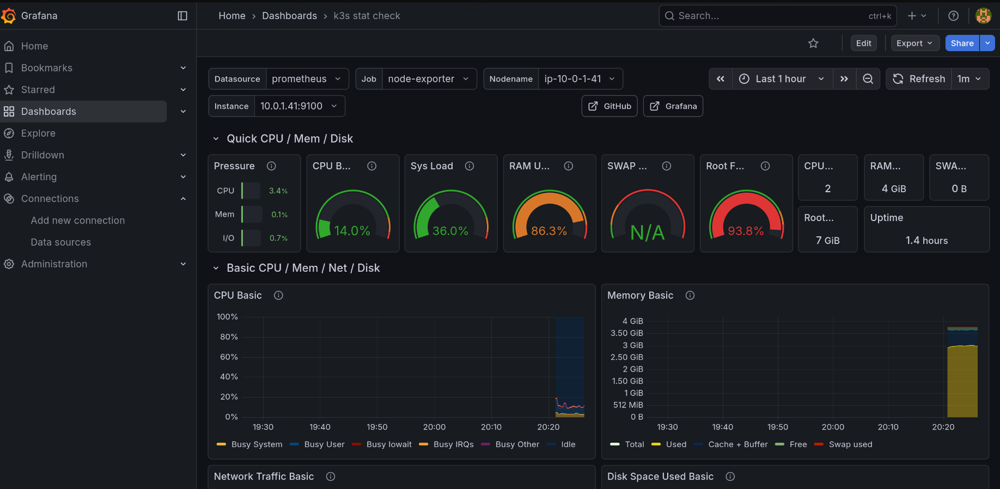

# LinkHub - Cloud-Native DevSecOps Platform

[](https://github.com/krishjj8/LinkHub/actions/workflows/deploy.yaml)

LinkHub is a production-grade, distributed microservices platform engineered to demonstrate modern **Platform Engineering** principles. Beyond standard functionality, this project serves as a rigorous implementation of a secure software supply chain, transitioning from manual deployments to a fully automated **GitOps** workflow.

The architecture addresses common scalability challenges through distributed caching, ephemeral infrastructure, and automated vulnerability scanning, ensuring reliability and security from code commit to production.

## System Demonstration


> The platform features a responsive frontend interacting with the backend microservices, handling user authentication, profile management, and link redirection with sub-millisecond latency.

---

## Architectural Highlights

The system has been evolved from a monolithic application into a resilient distributed system hosted on AWS.

### 1. DevSecOps Pipeline & Vulnerability Scanning
Security is integrated directly into the CI lifecycle ("Shift Left").
* **Automated CI:** GitHub Actions triggers on every commit to build the Java application.
* **Container Security:** Before pushing to the registry, the pipeline runs **Trivy** to scan the Docker image for Critical and High vulnerabilities (CVEs).
* **Artifact Management:** Secure artifacts are pushed to **AWS ECR (Elastic Container Registry)** only if they pass the security gates.


> *Figure 1: GitHub Actions pipeline execution showing successful build and Trivy vulnerability scan before pushing to AWS ECR.*

### 2. Zero-Touch GitOps Deployment (ArgoCD)
The deployment model replaces manual `kubectl` operations with a pull-based GitOps workflow using **ArgoCD**.
* **Single Source of Truth:** The Kubernetes manifest repository dictates the state of the cluster.
* **Automated Sync:** ArgoCD monitors the repository for changes (e.g., a new image tag from the CI pipeline) and automatically synchronizes the production cluster to match the desired state.
* **Self-Healing:** If a resource is manually modified in the cluster, ArgoCD detects the drift and restores the configuration defined in Git.


> *Figure 2: ArgoCD dashboard visualizing the application tree and successful synchronization of the frontend and backend microservices.*

### 3. Infrastructure as Code (Terraform)
The entire cloud environment is provisioned using Terraform, allowing for reproducible and ephemeral infrastructure.
* **Compute:** Provisioned AWS EC2 instances hosting a lightweight Kubernetes (K3s) cluster.
* **Network:** Custom VPC configuration with strict security groups to isolate the database layer.
* **Storage:** Managed AWS RDS (PostgreSQL) for persistence, decoupled from the compute layer.


> *Figure 3: Terraform output confirming the provisioning of AWS RDS and K3s compute resources.*

---

## Observability & Monitoring

To ensure operational excellence, the platform includes a comprehensive monitoring stack using **Prometheus** and **Grafana**.

* **Metric Collection:** Prometheus scrapes real-time metrics from the application, K3s nodes, and the underlying OS via Node Exporter.
* **Visualization:** A custom Grafana dashboard visualizes critical resource usage (CPU, Memory, Disk Pressure, and Network I/O), enabling proactive identification of bottlenecks (e.g., OOM kills or disk saturation).


> *Figure 4: Real-time observability dashboard showing cluster health, revealing high disk pressure and memory usage patterns during load testing.*

---

## Technology Stack

| Domain | Technology Choice |
| :--- | :--- |
| **Core Backend** | Java 17, Spring Boot 3, Spring Data JPA |
| **Data & Caching** | PostgreSQL (AWS RDS), Redis (Cluster Cache) |
| **Orchestration** | Kubernetes (K3s), Traefik Ingress |
| **GitOps & CI/CD** | ArgoCD, GitHub Actions, AWS ECR, Trivy |
| **Infrastructure** | Terraform (IaC), AWS VPC, EC2 |
| **Observability** | Prometheus, Grafana, Node Exporter |

---

## Project Roadmap

- [x] **Cloud Infrastructure:** Architected a secure, multi-tier AWS network using Terraform.
- [x] **Kubernetes Migration:** Migrated workloads from Docker Compose to a K3s cluster.
- [x] **GitOps Implementation:** Established a complete CI/CD pipeline bridging GitHub Actions and ArgoCD.
- [x] **Security Integration:** Implemented container image scanning with Trivy.
- [x] **Observability:** Integrated Prometheus and Grafana for real-time metric visualization.
- [x] **Performance:** Integrated Redis Cache-Aside pattern for high-read throughput.

---

## How to Run

### Local Development
1.  Clone the repository:
    ```bash
    git clone [https://github.com/krishjj8/LinkHub.git](https://github.com/krishjj8/LinkHub.git)
    ```
2.  Start the stack (Apps + DB + Redis):
    ```bash
    docker compose up --build
    ```

### Cloud Deployment
1.  Navigate to the infrastructure directory:
    ```bash
    cd infrastructure
    ```
2.  Initialize and apply Terraform:
    ```bash
    terraform init
    terraform apply
    ```
3.  The output will provide the Kubernetes connection strings and Database endpoints required for the cluster configuration.
