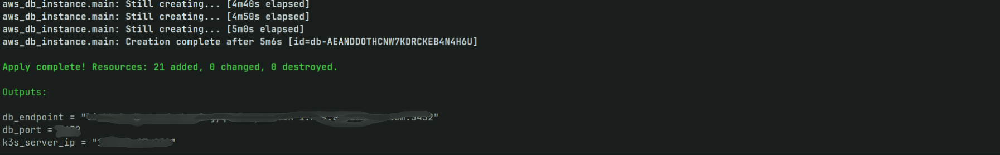

# LinkHub - Cloud-Native DevSecOps Platform

[](https://github.com/krishjj8/LinkHub/actions/workflows/deploy.yaml)

LinkHub is a production-grade, distributed microservices platform engineered to demonstrate modern **Platform Engineering** principles. Beyond standard functionality, this project serves as a rigorous implementation of a secure software supply chain, transitioning from manual deployments to a fully automated **GitOps** workflow.

The architecture addresses common scalability challenges through distributed caching, ephemeral infrastructure, and automated vulnerability scanning, ensuring reliability and security from code commit to production.

## System Demonstration

<p align="center">
  
</p>

> The platform features a responsive frontend interacting with the backend microservices, handling user authentication, profile management, and link redirection with sub-millisecond latency.

---

## Architectural Highlights

The system has been evolved from a monolithic application into a resilient distributed system hosted on AWS.

### 1. DevSecOps Pipeline & Vulnerability Scanning
Security is integrated directly into the CI lifecycle ("Shift Left").
* **Automated CI:** GitHub Actions triggers on every commit to build the Java application.
* **Container Security:** Before pushing to the registry, the pipeline runs **Trivy** to scan the Docker image for Critical and High vulnerabilities (CVEs).
* **Artifact Management:** Secure artifacts are pushed to **AWS ECR (Elastic Container Registry)** only if they pass the security gates.


> *Figure 1: GitHub Actions pipeline execution showing successful build and Trivy vulnerability scan before pushing to AWS ECR.*

### 2. Zero-Touch GitOps Deployment (ArgoCD)
The deployment model replaces manual `kubectl` operations with a pull-based GitOps workflow using **ArgoCD**.
* **Single Source of Truth:** The Kubernetes manifest repository dictates the state of the cluster.
* **Automated Sync:** ArgoCD monitors the repository for changes (e.g., a new image tag from the CI pipeline) and automatically synchronizes the production cluster to match the desired state.
* **Self-Healing:** If a resource is manually modified in the cluster, ArgoCD detects the drift and restores the configuration defined in Git.


> *Figure 2: ArgoCD dashboard visualizing the application tree and successful synchronization of the frontend and backend microservices.*

### 3. Infrastructure as Code (Terraform)
The entire cloud environment is provisioned using Terraform, allowing for reproducible and ephemeral infrastructure.
* **Compute:** Provisioned AWS EC2 instances hosting a lightweight Kubernetes (K3s) cluster.
* **Network:** Custom VPC configuration with strict security groups to isolate the database layer.
* **Storage:** Managed AWS RDS (PostgreSQL) for persistence, decoupled from the compute layer.


> *Figure 3: Terraform output confirming the provisioning of AWS RDS and K3s compute resources.*

---

## Observability & Monitoring

To ensure operational excellence, the platform includes a comprehensive monitoring stack using **Prometheus** and **Grafana**.

* **Metric Collection:** Prometheus scrapes real-time metrics from the application, K3s nodes, and the underlying OS via Node Exporter.
* **Visualization:** A custom Grafana dashboard visualizes critical resource usage (CPU, Memory, Disk Pressure, and Network I/O), enabling proactive identification of bottlenecks (e.g., OOM kills or disk saturation).


> *Figure 4: Real-time observability dashboard showing cluster health, revealing high disk pressure and memory usage patterns during load testing.*

---

## Technology Stack

| Domain | Technology Choice |
| :--- | :--- |
| **Core Backend** | Java 17, Spring Boot 3, Spring Data JPA |
| **Data & Caching** | PostgreSQL (AWS RDS), Redis (Cluster Cache) |
| **Orchestration** | Kubernetes (K3s), Traefik Ingress |
| **GitOps & CI/CD** | ArgoCD, GitHub Actions, AWS ECR, Trivy |
| **Infrastructure** | Terraform (IaC), AWS VPC, EC2 |
| **Observability** | Prometheus, Grafana, Node Exporter |

---

## Detailed Deployment & Engineering Guide

This project follows a "Manual Bootstrapping" approach to demonstrate a deep understanding of Kubernetes components.

```bash
# ============================================================
# Step 1: Provision Infrastructure (Terraform)
# ============================================================

cd infrastructure
terraform init
terraform apply --auto-approve
# Wait for Output: EC2 Public IP and RDS Endpoint


# ============================================================
# Step 2: Install K3s (Kubernetes)
# ============================================================

# SSH into the newly provisioned EC2 instance
ssh -i "linkhub-key.pem" ubuntu@<EC2_PUBLIC_IP>

# Install K3s on the server
curl -sfL [https://get.k3s.io](https://get.k3s.io) | sh -

# Verify K3s installation
sudo kubectl get nodes


# ============================================================
# Step 3: Configure Local Access (Kubeconfig)
# ============================================================

# On the SERVER: print the kubeconfig
sudo cat /etc/rancher/k3s/k3s.yaml

# On LOCAL MACHINE: create kube config directory
mkdir -p ~/.kube

# Open kubeconfig file
nano ~/.kube/config

# Paste the content copied from the server
# Replace:
#   server: [https://127.0.0.1:6443](https://127.0.0.1:6443)
# With:
#   server: https://<EC2_PUBLIC_IP>:6443

# Under clusters, add this line to bypass self-signed certs:
# insecure-skip-tls-verify: true

# Verify access to the remote cluster
kubectl get nodes


# ============================================================
# Step 4: Configure Kubernetes Secrets
# ============================================================

# ------------------------------------------------------------
# AWS ECR Pull Secret
# Allows K3s to pull private images from AWS ECR
# ------------------------------------------------------------

kubectl create secret docker-registry regcred \
  --docker-server=408834627625.dkr.ecr.ap-south-1.amazonaws.com \
  --docker-username=AWS \
  --docker-password=$(aws ecr get-login-password --region ap-south-1) \
  --docker-email=unused@example.com


# ------------------------------------------------------------
# Database Credentials Secret
# ------------------------------------------------------------

kubectl create secret generic db-credentials \
  --from-literal=password='YOUR_DB_PASSWORD'


# ============================================================
# Step 5: Install ArgoCD & Deploy Applications
# ============================================================

# Create ArgoCD namespace
kubectl create namespace argocd

# Install ArgoCD components
kubectl apply -n argocd \
  -f [https://raw.githubusercontent.com/argoproj/argo-cd/stable/manifests/install.yaml](https://raw.githubusercontent.com/argoproj/argo-cd/stable/manifests/install.yaml)

# Get initial ArgoCD admin password
kubectl -n argocd get secret argocd-initial-admin-secret \
  -o jsonpath="{.data.password}" | base64 -d; echo

# Port-forward ArgoCD server to local machine
kubectl port-forward svc/argocd-server -n argocd 8081:443

# Access ArgoCD UI in browser
# URL: https://localhost:8081
# Username: admin
# Password: output from above command


# ============================================================
# Engineering Challenges & Troubleshooting
# ============================================================

# ------------------------------------------------------------
# Issue 1: Resource Starvation (t2.micro)
# ------------------------------------------------------------

# Symptoms:
# - Node entered NotReady state
# - Prometheus + Grafana + ArgoCD caused OOM kills

# Diagnosis:
kubectl describe node

# Root Cause:
# - t2.micro (1 vCPU, 1GB RAM)
# - Control plane consumed ~600MB RAM

# Fix:
# - Migrated to t3.medium (2 vCPU, 4GB RAM) using Terraform


# ------------------------------------------------------------
# Issue 2: Disk Pressure & Pod Evictions
# ------------------------------------------------------------

# Symptoms:
# - Grafana pods stuck in Pending

# Diagnosis:
kubectl describe pod <pod-name>

# Error observed:
# node.kubernetes.io/disk-pressure

# Root Cause:
# - Default 8GB root volume
# - Disk filled by images, logs, Prometheus WAL

# Immediate Fix:
crictl rmi --prune

# Long-Term Fix:
# - Increased EBS root volume to 20GB via Terraform
# - Added Node Exporter dashboard in Grafana
# - Alerting at >80% disk usage


# ============================================================
# Project Roadmap
# ============================================================

# [x] AWS Infrastructure via Terraform
# [x] Docker Compose -> Kubernetes (K3s)
# [x] GitOps CI/CD with GitHub Actions + ArgoCD
# [x] Security scanning using Trivy
# [x] Observability with Prometheus & Grafana
# [x] Performance optimization using Redis Cache-Aside pattern


# ============================================================
# How to Run Locally
# ============================================================

# Clone the repository
git clone [https://github.com/krishjj8/LinkHub.git](https://github.com/krishjj8/LinkHub.git)
cd LinkHub

# Start local stack (App + DB + Redis)
docker compose up --build
