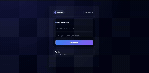

# LinkHub - Cloud-Native DevSecOps Platform

[](https://github.com/krishjj8/LinkHub/actions/workflows/deploy.yaml)

LinkHub is a production-grade, distributed microservices platform engineered to demonstrate modern **Platform Engineering** principles. Beyond standard functionality, this project serves as a rigorous implementation of a secure software supply chain, transitioning from manual deployments to a fully automated **GitOps** workflow.

The architecture addresses common scalability challenges through distributed caching, ephemeral infrastructure, and automated vulnerability scanning, ensuring reliability and security from code commit to production.

## System Demonstration

<p align="center">
  
  
</p>

> The platform features a responsive frontend interacting with the backend microservices, handling user authentication, profile management, and link redirection with sub-millisecond latency.

---

## Architectural Highlights

The system has been evolved from a monolithic application into a resilient distributed system hosted on AWS.

### 1. DevSecOps Pipeline & Vulnerability Scanning
Security is integrated directly into the CI lifecycle ("Shift Left").
* **Automated CI:** GitHub Actions triggers on every commit to build the Java application.
* **Container Security:** Before pushing to the registry, the pipeline runs **Trivy** to scan the Docker image for Critical and High vulnerabilities (CVEs).
* **Artifact Management:** Secure artifacts are pushed to **AWS ECR (Elastic Container Registry)** only if they pass the security gates.


> *Figure 1: GitHub Actions pipeline execution showing successful build and Trivy vulnerability scan before pushing to AWS ECR.*

### 2. Zero-Touch GitOps Deployment (ArgoCD)
The deployment model replaces manual `kubectl` operations with a pull-based GitOps workflow using **ArgoCD**.
* **Single Source of Truth:** The Kubernetes manifest repository dictates the state of the cluster.
* **Automated Sync:** ArgoCD monitors the repository for changes (e.g., a new image tag from the CI pipeline) and automatically synchronizes the production cluster to match the desired state.
* **Self-Healing:** If a resource is manually modified in the cluster, ArgoCD detects the drift and restores the configuration defined in Git.


> *Figure 2: ArgoCD dashboard visualizing the application tree and successful synchronization of the frontend and backend microservices.*

### 3. Infrastructure as Code (Terraform)
The entire cloud environment is provisioned using Terraform, allowing for reproducible and ephemeral infrastructure.
* **Compute:** Provisioned AWS EC2 instances hosting a lightweight Kubernetes (K3s) cluster.
* **Network:** Custom VPC configuration with strict security groups to isolate the database layer.
* **Storage:** Managed AWS RDS (PostgreSQL) for persistence, decoupled from the compute layer.


> *Figure 3: Terraform output confirming the provisioning of AWS RDS and K3s compute resources.*

---

## Observability & Monitoring

To ensure operational excellence, the platform includes a comprehensive monitoring stack using **Prometheus** and **Grafana**.

* **Metric Collection:** Prometheus scrapes real-time metrics from the application, K3s nodes, and the underlying OS via Node Exporter.
* **Visualization:** A custom Grafana dashboard visualizes critical resource usage (CPU, Memory, Disk Pressure, and Network I/O), enabling proactive identification of bottlenecks (e.g., OOM kills or disk saturation).


> *Figure 4: Real-time observability dashboard showing cluster health, revealing high disk pressure and memory usage patterns during load testing.*

---

## Technology Stack

| Domain | Technology Choice |
| :--- | :--- |
| **Core Backend** | Java 17, Spring Boot 3, Spring Data JPA |
| **Data & Caching** | PostgreSQL (AWS RDS), Redis (Cluster Cache) |
| **Orchestration** | Kubernetes (K3s), Traefik Ingress |
| **GitOps & CI/CD** | ArgoCD, GitHub Actions, AWS ECR, Trivy |
| **Infrastructure** | Terraform (IaC), AWS VPC, EC2 |
| **Observability** | Prometheus, Grafana, Node Exporter |

---

## Detailed Deployment Guide

This project follows a "Manual Bootstrapping" approach for the Kubernetes cluster to demonstrate a deep understanding of cluster components.

### Step 1: Provision Infrastructure
```bash
cd infrastructure
terraform init
terraform apply --auto-approve

Markdown

### Step 2: Install K3s (Kubernetes)
SSH into the newly provisioned EC2 instance:
```bash
ssh -i "linkhub-key.pem" ubuntu@<EC2_PUBLIC_IP>

Once inside the server, run the K3s installer:
Bash

curl -sfL [https://get.k3s.io](https://get.k3s.io) | sh -

Step 3: Configure Local Access (Kubeconfig)

We need to access the remote cluster from our local machine.

    On the Server: Copy the K3s config.
    Bash

sudo cat /etc/rancher/k3s/k3s.yaml

On Local Machine: Copy the output from above. Open your local kubeconfig:
Bash

nano ~/.kube/config

Update Config: Paste the content, replace 127.0.0.1 with the EC2_PUBLIC_IP. Add the following line under clusters to bypass self-signed certificate errors:
YAML

    insecure-skip-tls-verify: true

Step 4: Configure Secrets

Create the necessary secrets for AWS ECR and the Database connection:
Bash

# 1. ECR Pull Secret (Allows K3s to pull private images)
kubectl create secret docker-registry regcred \
  --docker-server=408834627625.dkr.ecr.ap-south-1.amazonaws.com \
  --docker-username=AWS \
  --docker-password=$(aws ecr get-login-password --region ap-south-1) \
  --docker-email=unused@example.com

# 2. Database Credentials
kubectl create secret generic db-credentials --from-literal=password='YOUR_DB_PASSWORD'

Step 5: Install ArgoCD & Deploy
Bash

kubectl create namespace argocd
kubectl apply -n argocd -f [https://raw.githubusercontent.com/argoproj/argo-cd/stable/manifests/install.yaml](https://raw.githubusercontent.com/argoproj/argo-cd/stable/manifests/install.yaml)

# Get Initial Password
kubectl -n argocd get secret argocd-initial-admin-secret -o jsonpath="{.data.password}" | base64 -d; echo

# Access UI
kubectl port-forward svc/argocd-server -n argocd 8081:443

Access ArgoCD at https://localhost:8081 and sync the applications.
Engineering Challenges & Troubleshooting

Building a production-grade platform involves overcoming resource constraints and infrastructure bottlenecks.
1. The "Resource Starvation" Incident (t2.micro vs t3.medium)

    The Problem: Initially, I deployed the cluster on AWS t2.micro instances (1 vCPU, 1GB RAM) to stay within the Free Tier. However, as soon as the monitoring stack (Prometheus + Grafana) and ArgoCD were deployed alongside the application, the node entered a NotReady state.

    Diagnosis: kubectl describe node revealed System OOM (Out of Memory) events. The control plane components alone were consuming ~600MB RAM, leaving insufficient memory for the Java application.

    The Fix: Migrated the infrastructure to t3.medium instances (2 vCPUs, 4GB RAM) via Terraform. This provided enough headroom for the Java Heap and the monitoring sidecars.

2. Debugging "Disk Pressure" & Pod Eviction

    The Problem: During a deployment cycle, the Grafana pods became stuck in a Pending state.

    Diagnosis: Using kubectl describe pod, I identified the error: 0/1 nodes are available: 1 node(s) had untolerated taint {node.kubernetes.io/disk-pressure: }.

    Root Cause Analysis: The K3s node was running on a default 8GB root volume. The accumulation of Docker images, Prometheus WAL (Write Ahead Logs), and system logs filled the disk to >85%, triggering Kubernetes eviction policies.

    Resolution:

        Immediate Relief: Ran crictl rmi --prune to clean up unused container images and regain 2GB of space.

        Long-term Fix: Updated the Terraform configuration to provision a larger 20GB EBS Root Volume for the worker nodes.

        Observability: Added the "Node Exporter" dashboard in Grafana to visualize disk usage trends and set alerts for >80% usage (as seen in Figure 4).

Project Roadmap

    [x] Cloud Infrastructure: Architected a secure, multi-tier AWS network using Terraform.

    [x] Kubernetes Migration: Migrated workloads from Docker Compose to a K3s cluster.

    [x] GitOps Implementation: Established a complete CI/CD pipeline bridging GitHub Actions and ArgoCD.

    [x] Security Integration: Implemented container image scanning with Trivy.

    [x] Observability: Integrated Prometheus and Grafana for real-time metric visualization.

    [x] Performance: Integrated Redis Cache-Aside pattern for high-read throughput.

How to Run Locally
Local Development

    Clone the repository:
    Bash

git clone [https://github.com/krishjj8/LinkHub.git](https://github.com/krishjj8/LinkHub.git)

Start the stack (Apps + DB + Redis):
Bash

docker compose up --build
